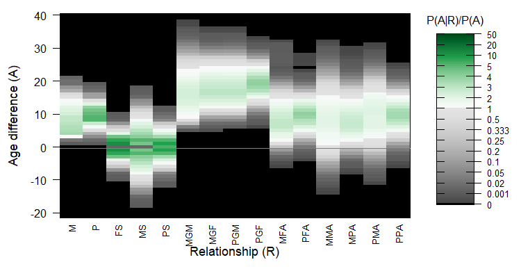

# In short

```{r setup, include=FALSE}
library(knitr)
library(sequoia)
knitr::opts_chunk$set(echo = TRUE, 
                      fig.height=4, fig.width=6, 
                      fig.pos="ht!")
```


## Age Info is Useful 
The age difference between a pair of individuals can be useful information during pedigree reconstruction. It can exclude some relationship alternatives from consideration, as for example parent and offspring can never be born in the same time unit. It can also help to distinguish between the different types of second degree relatives, as the age difference between siblings is typically much smaller than between grandparent and grand-offspring. 

```{r DeerAP, echo=FALSE, fig.cap="Example of 'ageprior' distribution in a red deer population", out.width="90%"} 
   
```


## Implementation
While the rule that parent and offspring cannot have an age difference of $0$ is universal, the pattern of age difference distributions for various relationships is highly species-specific, or even population-specific (example in Figure \@ref(fig:DeerAP)). Here `sequoia`'s separation between 1) assignment of genotyped parents to genotyped offspring and 2) full pedigree reconstruction including sibship clustering comes in handy. The age difference distribution for each relationship type is estimated based on the former, and then used as input for the latter (Figure \@ref(fig:pipeline)). 

```{r pipeline, echo=FALSE, fig.cap="Pipeline overview", out.width="90%"} 
knitr::include_graphics("agepriors-pipeline.png")
```


More specifically, age information is implemented via the ratio between the proportion of pairs with age difference $A$ among those with relationship $R$, and the proportion in the entire sample (i.e. $P(A|R)/P(A)$). Scaling by the latter accounts for the fact that any sampling period is finite, so that smaller age differences are always more common than very large age differences. 

Some reshuffling of terms (see [Maths]) shows that this probability ratio can be interpreted as

> *If I were to pick two individuals with an age difference $A$, and two individuals at random, how much more likely are the first pair to have relationship $R$, compared to the second pair? *

i.e. the probability of having relationship $R$ conditional on the age difference $A$ ($P(R|A)/P(R)$). 

As a shorthand, these probability ratios are dubbed 'agepriors', but please note that this is not an official term, nor a proper prior.

During full pedigree reconstruction, the genetic based likelihood that two individuals are related via relationship $R$ is multiplied by this age based probability ratio. The latter may be $0$ for some relationships, and then excludes these relationships from consideration. In other cases, it will 'nudge' the likelihoods up or down. 


### Passing the threshold
By default, age information is used in a restrictive way: a proposed assignment is only accepted if *both* the genetics-only and the genetics + age likelihood ratio (LLR) pass the assignment threshold. The genetics-only likelihoods do exclude those relationships that are impossible based on the age difference. You can change this behaviour to only the genetics LLR or only the genetics + age LLR having to pass the threshold via the `sequoia()` argument `UseAge`. See the section with that name in the main vignette for further details. 


## Time units
Throughout this documentation, 'birth year' is used to refer to the year/month/week/day/(other time unit) of birth/hatching/germination/... . The time units should be chosen such that parent and offspring can never be born in the same time unit, i.e. be smaller than or equal to the minimum age of maturity. `sequoia()` only accepts whole numbers as 'birth years'.  


## Runtime Messages
From `sequoia` version 2.0 onwards, you will see heatmaps and messages to inform you about the ageprior that is being used. These are for example 

> `Ageprior: Default 0/1, overlapping generations, MaxAgeParent = 5,5`
>
> `Ageprior: Pedigree-based, discrete generations, MaxAgeParent = 1,1`
>
> `Ageprior: Pedigree-based, overlapping generations, smoothed, MaxAgeParent = 20,16`

These are *not* warnings, but inform you on what is going on behind the scenes. This will hopefully minimise unintended age priors as a source of error during pedigree reconstruction. There are four parts to the message:

- `Default 0/1`, `Flat 0/1`, or `Pedigree-based` indicates whether the ageprior at that point is respectively the default based on lifehistory data only/no data; based on user-specified maximum parental age; or or based on the age-differences per relationship in a (scaffold or old) pedigree;
- `discrete` or `overlapping` generations  
- `smoothed` and/or `flattened` indicate [small-sample corrections](#sec:smallCorr) for the pedigree-based age prior (no mention means it was not applied)  
- Maximum age of mothers, fathers.


## Changing the ageprior
During pedigree reconstruction, arguments can be passed to `MakeAgePrior()`  via `sequoia()`'s `args.AP`. It is also possible to call `MakeAgePrior()` separately and use the resulting ageprior (via `sequoia()`'s `Seqlist` argument), or use a 'hand-tailored' ageprior (see [Customisation](#sec:customAP)).


# Maths

## AgePrior
The ageprior $\alpha_{A,R}$ (Glossary in Table \@ref(tab:Glossary)) tells us how the probability that two individuals have relationship $R$ changes when learning their age difference $A$, or 

\begin{equation}
	\alpha_{A,R} = \frac{P(R|A)}{P(R)} \text{ .}
	(\#eq:AP)
\end{equation}

Using Bayes' rule that  
\begin{equation}
	P(R|A) = \frac{P(A|R) P(R)}{P(A)}
\end{equation}

it follows that, if $P(A)$ and $P(R)$ are independent, 
\begin{equation}
	\alpha_{A,R} = \frac{P(R|A)}{P(R)} = \frac{P(A|R)}{P(A)} \text{ .}
	(\#eq:AP2)
\end{equation}

When a pedigree and birth years are known, $P(A)$ and $P(A|R)$ are estimated as the observed proportions of individual pairs with age-difference $A$ among all pairs ($P(A)$) and among parent-offspring and sibling pairs with relationship $R$ ($P(A|R)$) (see worked-out example in Section [Overlapping generations](#sec:overlap)). 


```{r Glossary, echo=FALSE, results="asis"}
Glossary <- matrix(c("$BY_i$", "Birth year", "Time unit (year, decade, month) of $i$'s birth/ hatching",
         "$A_{i,j}$", "Age difference",  "$BY_i - BY_j$, i.e. if $j$ is older than $i$, than $A_{i,j}$ is positive",
         "$R_{i,j}$", "Relationship", "Relationship between $i$ and $j$, e.g. parent-offspring",
         "$\\alpha_{A,R}$", "Ageprior", "Probability ratio of relationship $R$ given $A$, versus $R$ for a random pair"),
       ncol=3, byrow=TRUE)

knitr::kable(Glossary, col.names = c("Symbol", "Term", "Definition"),
            caption="Terms and abbreviations", escape=FALSE, booktabs=TRUE)
```


## Unsampled individuals {#sec:unsampled}
When using the scaffold parentage-only pedigree as input, $\alpha_{A_R}$ is based only on pairs which are both genotyped and which both have a known birth year. During full pedigree reconstruction, we assume that the association between age difference and relationship probability is roughly the same for pairs where either or both individuals are unsampled (i.e. dummy individuals), or for whom the birthyear is unknown:


\begin{equation}
	\frac{P(R|A, \text{sampled})}{P(R| \text{sampled})} \approx \frac{P(R|A, \text{unsampled})}{P(R | \text{unsampled})} 
	(\#eq:APsampled)
\end{equation}


This does *not* mean that sampling probability is assumed to be independent of $A$: any sampling period is finite, thus there are always fewer both-sampled pairs with large age differences than with small age differences ($P(A|sampled) \neq P(A|unsampled)$). It *does* assume that the probability to both be sampled is independent of relationship $R$ ($P(A|sampled) \approx P(A|unsampled)$), so that 

\begin{equation}
	\frac{P(A|R, \text{sampled})}{P(A| \text{sampled})} \approx
	\frac{P(A|R, \text{unsampled})}{P(A| \text{unsampled})}  \text{,}
\end{equation}

i.e. it is assumed that $\alpha_{A_R}$ calculated from both-sampled pairs is valid for pairs where one or both are unsampled. 

This assumption is relaxed via the [small-sample correction](#sec:smallCorr). 


## Genetics $\times$ Age
During pedigree reconstruction, the ageprior $\alpha_{A,R}$ is multiplied by the genotypes-depended probability,

\begin{equation}
	P(R_{i,j}| G_i, G_j, A_{i,j}) = P(R_{i,j} | G_i, G_j) \times \alpha_{R_{i,j}, A_{i,j}}  \text{ ,}
	(\#eq:GxA)
\end{equation}
as it can be reasonably assumed that conditional on the relationship $R$, the genotypes $G$ and age difference $A$ are independent (at least on the time scales relevant for pedigree reconstruction). The calculation of $P(R_{i,j} | G_i, G_j)$ is described in detail in @huisman17. 

For a pair of individuals, $P(R_{i,j} | G_i, G_j)$ in \@ref(eq:GxA) for various relationships can be obtained with `CalcPairLL()`, and $\alpha_{R_{i,j}, A_{i,j}}$ with `GetGetLLRAge()`.


# AgePrior matrix explained
The ageprior matrix has 5 columns (more in sequoia versions before 2.0), corresponding to parent-offspring and sibling pairs (abbreviations in Table \@ref(tab:RelAbbr)). The number of rows equals at least the maximum age of parents (`MaxAgeParent`) plus one: the first row is for individuals born in the same year (age difference $A=0$), the second row for individuals born one year apart, etc (indicated by the rownames). 


```{r AP-grif1, out.width="70%"}
MakeAgePrior(Pedigree = Ped_griffin, Smooth=FALSE, Flatten=FALSE)  # Note: Ped_griffin includes a birth year column
```


A value of $0$ (black squares in the plot) indicates that an age difference / relationship combination is impossible; in the example here this is the case for among others mother-offspring pairs (`M`, first column) and age differences of 0 and 4. Any age differences not in this matrix (i.e. >4 years) are considered impossible ($0$) for all five relationships. Values greater than $1$ (green) indicate a relationship is more likely for that age difference than for a random pair, while values below $1$ (grey) indicate the relationship is less likely. 


```{r RelAbbr, echo=FALSE}
as.DF <- function(V, cn=c("name", "x")) {  # named vector --> data.frame
  setNames(data.frame(c1 = names(V), c2=V), cn)
}

Rels <- c(M = "Mother - offspring",
          P = "Father - offspring",
          FS = "Full siblings",   # From version XX
          MS = "Maternal siblings (full + half)",
          PS = "Paternal siblings (full + half)",
          MGM = "Maternal grandmother",
          PGF = "Paternal grandfather",
          MGF = "Maternal grandfather (+ paternal grandmother)",
          UA = "avuncular (niece/nephew -- aunt/uncle, full + half)",
          "(M/P)(M/P/F)A" = "Avuncular; Mother's/Father's Maternal/Paternal/Full sibling")

Rels <- cbind(as.DF(Rels, c("Column (R)", "Meaning")),
              "Version" = c(rep("all", 2), "from 1.0", "all", "all",
                            rep("up to 1.3 *", 3), "up to 1.3",
                            "from 2.0 *"))

knitr::kable(Rels, row.names=FALSE, booktabs=TRUE,
             caption = "AgePriors column names per sequoia version. *: From sequoia v2.0 only in AgePriorExtra")
``` 


## `AgePriorExtra`
The agepriors for grand-parental en avuncular pairs are calculated from the agepriors for parent-offspring and sibling relationships (details in section [Grandparents & Avuncular](#sec:GP-AU)). These extra columns are not calculated by `MakeAgePrior()`, but  by `sequoia()` just prior to parentage assignment and prior to full pedigree reconstruction (see pipeline in Figure \@ref(fig:pipeline)). 


```{r AP-grif2}
# sequoia() output for the griffin data is included in the package:
# see ?SeqOUT_griffin on how it was generated
round(SeqOUT_griffin$AgePriorExtra, 2)
PlotAgePrior(SeqOUT_griffin$AgePriorExtra)
```


The ageprior for avuncular pairs is complicated: aunts and uncles are often older than their nieces/nephews, but may also be younger, and the distribution is not necessarily symmetrical around zero. To accommodate this, age differences in `AgePriorExtra` are no longer absolute age differences, but do go negative. Parents and grandparents must always be older than their (grand-)offspring, and the distribution for siblings is always strictly symmetrical.  


# Default ageprior  {#sec:Default}
The default ageprior used during parentage assignment is flat and minimally informative: it only specifies that parent and offspring cannot have an age difference of 0 ($\alpha_{A,R}=0$ for $A=0$ and $R=M$ or $R=P$, black in Figure \@ref(fig:AP-default)) and that all other age / relationship combinations are allowed ($\alpha_{A,R}=1$, pale green). 

```{r AP-default, fig.cap="Default minimally informative ageprior", out.width = "70%"}
MakeAgePrior(LifeHistData = LH_HSg5)
```


The range of possible age differences is taken from `LifeHistData`: 

```{r AP-default-2}
table(LH_HSg5$BirthYear)
```

The maximum age of parents `MaxAgeParent` is initially set to the maximum age difference possible among individuals in `LifeHistData` (here 2005-2000 = 5 years) $+1$. This ensures that all pairs are age-wise considered as potential siblings [^a]; the age difference between siblings can never be larger than `MaxAgeParent` $-1$. 


[^a]: Up to version 2.0, initial `MaxAgeParent` was  set to `diff(BYrange)`, but sibling relationships were also allowed at this age difference, so this change (probably) won't affect parentage assignment or full pedigree reconstruction.  


<!--- Both the ageprior used during parentage assignment and the one used during full pedigree reconstruction can be [customised](#sec:customAP) in various ways. --->


# Pedigree-based ageprior


## Discrete generations {#sec:Discrete}
When a pedigree is provided as input, `MakeAgePrior()` always checks whether generations are non-overlapping, i.e. whether all parents have the same the same age (typically 1), and all siblings have an age difference of 0. If these conditions are met, and there are at least 20 pairs each of mother-offspring, father-offspring, maternal half/full siblings, and paternal half/full siblings, it is concluded that generations are discrete. This auto-detection can be turned off by explicitly declaring `Discrete=TRUE` or `Discrete=FALSE`. If `Discrete=TRUE` is declared, a check is still performed, and any violations result in an error. When discrete generations are automatically inferred or explicitly declared, small-sample corrections `Smooth` and `Flatten` are always set to `FALSE`. 

When `Discrete = TRUE` is specified prior to parentage assignment, being full siblings is no longer considered as a potential relationship alternative for candidate parents (age difference of 1), but being an aunt/uncle is (Figure \@ref(fig:APdiscrete)). When the genetic information is ambiguous (few SNPs and/or high genotyping error rate) this may increase the assignment rate, but it may also increase the number of incorrect assignments. 

Similarly, during full pedigree reconstruction, pairs with an age difference of 0 are considered potentially full siblings, half siblings, cousins (not shown in ageprior plot), or unrelated. In contrast, with overlapping generations they are (typically) also considered as potential full avuncular pairs, which are often difficult to distinguish from half-sibling pairs [^1].

[^1]: Both individuals need to have already at least one parent assigned to be able to genetically distinguish between half-siblings, full avuncular, and grandparent--grand-offspring


```{r APdiscrete, fig.cap="Discrete generations"}
# running sequoia to also get the extra ageprior columns: 
Seq_HSg5 <- sequoia(SimGeno_example, LH_HSg5, Module="ped",
                    args.AP=list(Discrete = TRUE),
                    CalcLLR=FALSE, Plot=FALSE, quiet=TRUE)
PlotAgePrior(Seq_HSg5$AgePriorExtra) 
```


### Generation interval different from 1
When generations do not overlap, it is often most straightforward to use generation number instead of birth year, such that parents and offspring are born 1 time unit apart. This is assumed to be the case when `Discrete=TRUE` is specified, but can be altered via `MaxAgeParent` (which in this situation is the *only* allowed age for parents). For example, pink salmon have a strict two-year life-cycle with odd-year and even-year populations:
```{r APDiscrete2}
MakeAgePrior(Discrete = TRUE, MaxAgeParent = 2, Plot=FALSE)
```


## Overlapping generations {#sec:overlap}
Estimation of the agepriors from a pedigree and birth years normally requires little to no user input, but it can be useful to understand what goes on 'under the hood' in case you wish to customise the ageprior, when things go wrong, or just out of curiosity. 

The process is here illustrated using an imaginary population of griffins, were each year exactly 20 baby griffins hatch. From 2001 to 2010, all juveniles are sampled, and parents assigned.

```{r pedHead}
tail(Ped_griffin)      # the pedigree
```

We can calculate the ageprior matrix, and also return all the intermediate steps by specifying `Return='all'` (we come back to `Smooth` and `Flatten` [later](#sec:smallCorr)):
```{r APall, fig.cap="Ageprior for overlapping generations (griffin example)", fig.pos="h!", out.width = "70%"}
AP.griffin <- MakeAgePrior(Ped_griffin, Smooth=FALSE, Flatten=FALSE, 
                           Return="all")   
names(AP.griffin)
```

<!--- We see in the plot that both dams and sires have a maximum age of 3 years, and that for dams (M: Maternal) age 1 is most common (darkest green), while for sires (P:Paternal) age 2 is most common.  ---> 

The order of elements in the output list is also the order in which they are calculated inside `MakeAgePrior()`. 

### `BirthYearRange`
`BirthYearRange` is the minimum and maximum birth year in `LifeHistData` (or in the `birthyear` column in the pedigree). This determines the maximum age difference between pairs of (sampled) individuals.

```{r BYrange}
AP.griffin$BirthYearRange
```


### `MaxAgeParent`  {#sec:MaxAgePO}
The maximum age of female and male parents, `MaxAgeParent`, is initially set equal to the maximum age difference between any kind of pairs (`diff(BirthYearRange)`) $+1$ (see [Default Ageprior](#sec:Default)), when not explicitly specified as input. If the pedigree includes at least 20 mother-offspring and/or father-offspring pairs with known age difference, the maximum parental age for that sex is updated to the maximum of the user-specified and pedigree-calculated values. 

```{r MAP}
AP.griffin$MaxAgeParent
```

For example, if you know that males can live and breed to age 5, but you have only sampled males up to age 3, you can and should adjust the age prior -- this will namely also affect the maximum age difference between paternal siblings during the full pedigree reconstruction. This adjustment works via [`Flatten`](#sec:Flatten).


```{r IncrMAP, out.width = "70%"}
# Specify maximum age for fathers, but estimate max mother age from pedigree 
APX <- MakeAgePrior(Ped_griffin, Smooth=FALSE, MaxAgeParent = c(NA, 5))
```


### Counts: `tblA.R`  {#sec:tblAR}
The list element `tblA.R` contains the raw counts of each age difference $A$ per relationship $R$:
```{r tblAR}
AP.griffin[["tblA.R"]]
```

For this table, the relationship between each pair of individuals according to the pedigree is obtained with `GetRelM()`, and a matrix with the age differences between all pairs is calculated using `outer()`: 

```{r tblAR-2}
AgeDifM <- outer(Ped_griffin$birthyear, Ped_griffin$birthyear, "-")
# closest relationship for each pair:
RelM <- GetRelM(Ped_griffin, patmat=TRUE, GenBack=1)
table(c(AgeDifM), c(RelM))  # vectorising first speeds up table() a lot
```
Some 'polishing' of this table is required, as each pair of individuals is included twice: 
```{r tblAR-2a}
# - 'MaxT' ensures sufficient, constant number of rows across intermediary tables
MaxAgeParent <- c(NA, NA)
MaxAgePO <- ifelse(!is.na(MaxAgeParent), MaxAgeParent, diff(AP.griffin$BirthYearRange)+1)  # in actual code with thorough input checks
MaxT <- max(MaxAgePO+1, diff(AP.griffin$BirthYearRange))

# - factor() ensures levels with 0 count are included
# - drop negative age differences: all pairs are included 2x
tblA.R <- table(factor(AgeDifM, levels = 0:MaxT),
                factor(RelM, levels = c("M", "P", "FS", "MHS", "PHS")))
```

And a further improvement by using every relationship for each pair, rather than only their closest relationship (a pair may e.g. be both mother-offspring & paternal half-siblings):
```{r tblAR-2b}
RelA <- GetRelM(Ped_griffin, patmat=TRUE, GenBack=1, Return="Array")
tblA.R <- sapply(c("M", "P", "FS", "MHS", "PHS"),
                 function(r) table(factor(AgeDifM[RelA[,,r]==1], 
                                          levels = 0:MaxT)))
head(tblA.R)
```

The ageprior is for 'maternal siblings', which includes both maternal half-siblings and full siblings, and similarly for paternal siblings. Lastly, a column with the total count of pairs per age difference is added (i.e. the denominator in the calculation of $\alpha_{A,R}$. For this reference age-difference distribution all individuals in the pedigree with known birth year in `LifeHistData` are used.

```{r tblAR-2c}
tblA.R <- cbind(tblA.R,
                  "MS" = tblA.R[,"MHS"] + tblA.R[,"FS"],
                  "PS" = tblA.R[,"PHS"] + tblA.R[,"FS"])
tblA.R <- tblA.R[, c("M", "P", "FS", "MS", "PS")]  # drop MHS & PHS columns


# add column for age diff. across all relationships (except 'Self' pairs)
tblA.R <- cbind(tblA.R,
                "X" = table(factor(AgeDifM[c(RelM)!="S"], levels = 0:MaxT))) 

# All pairs are included 2x in AgeDifM/RelM/RelA, to fix this:
# - drop the negative age differences  (done with factor() above)
# - divide counts for row A=0 by 2  (including 'X' column)
tblA.R["0", ] <- tblA.R["0", ] / 2  

# check that this is really the output from MakeAgePrior():
all(tblA.R == AP.griffin[["tblA.R"]])
```


### P(A|R): `PA.R`
The probability of age difference $A$ conditional on relationship $R$ is estimated as the proportion of pairs with relationship $R$ and known age difference, that have age difference $A$.  

```{r calcPAR}
NAK.R <- colSums(tblA.R, na.rm=TRUE)  # total count per relationship
NAK.R
PA.R <- sweep(tblA.R, 2, STATS=NAK.R, FUN="/")
head(round(PA.R, 2))
```

Pairs where one or both individuals have an unknown age difference, are excluded from both the numerator and the denominator. It is assumed that the age difference distribution of these pairs of relatives follows the same distribution as for relatives for which the age difference *is* known (Section [Unsampled individuals](#sec:unsampled)). 


### Full sibling correction {#sec:FSuseHS}
Sometimes full sibling pairs are rare, causing an imprecise estimate of their age-difference distribution. A reasonable assumption is that the distribution for full siblings is broadly similar to "happens to be both maternal and paternal sibling" [^2]. If many half-sibling pairs have been sampled, their age distribution is used to improve the estimate of $P(A|FS)$ (this is not optional): 


[^2]: This is not necessarily the case. For example, in species that produce multiple offspring each year, and breed for multiple years, within-year (within-clutch) siblings are more likely to be full siblings than between-year siblings
 

```{r FSuseHS}
MinPairs.AgeKnown <- 20   # not user-setable.
# Use the product of the distributions if there are many MS & PS,
# and the average across the two distributions if there are a medium number:
if (NAK.R["FS"] / min(NAK.R[c("MS", "PS")]) < 0.5 & 
    all(NAK.R[c("MS", "PS")] > MinPairs.AgeKnown)) {
  if (all(NAK.R[c("MS", "PS")] > 5*MinPairs.AgeKnown)) {
    FS.tmp <- PA.R[,"MS"] * PA.R[,"PS"]
    FS.tmp <- FS.tmp/sum(FS.tmp)
  } else {
    FS.tmp <- apply(PA.R[, c("MS", "PS")], 1, mean)
  }
  PA.R[,"FS"] <- (PA.R[,"FS"] + FS.tmp)/2
}

round(PA.R[1:5, ], 2)  # note change in 'FS' column
```


### Ageprior P(A|R)/P(A): `LR.RU.A.raw`  {#sec:standardise}
The age-difference based probability ratio $\alpha_{A,R}$ is calculated by dividing $P(A|R)$ (each relationship column) by $P(A)$ (the `X` column):
```{r calcLRAR}
LR.RU.A <- sweep(PA.R[, 1:5], 1, STATS=PA.R[,"X"], FUN="/")
head(round(LR.RU.A, 2))

# check that this is identical to output from MakeAgePrior():
LR.RU.A[!is.finite(LR.RU.A)] <- 0
all(abs(LR.RU.A  - AP.griffin[["LR.RU.A.raw"]]) < 0.001)  # allow for rounding errors
```

This is the non-flattened, non-smoothed ageprior, stored in list element `[["LR.RU.A.raw"]]`. Since in this example `Smooth=FALSE` and `Flatten=FALSE`, it is identical to list element `[["LR.RU.A"]]`, which is the default output (`Return='LR'`). 

 
 
# Small sample correction {#sec:smallCorr}
Calculating the proportion of pairs with relationship $R$ and age difference $A$ in a pedigree is [reasonably straightforward](#sec:overlap), but generating a matrix that is useful for subsequent pedigree reconstruction under a wide range of 'non-ideal' situations is not. 


## The problem
A major challenge is that when an age/relationship combination is not observed in the input pedigree, its ageprior value will be $0$, and without correction that age/relationship combination will be deemed impossible during full pedigree reconstruction. For example, if mother-offspring pairs with age differences of 1, 2, 3, and 5 years are observed, it would infer that females never breed at age 4. This seems highly unlikely from a biological perspective, and is much more likely a sampling artefact. This does matter during full pedigree reconstruction: if the true maternal grandmother is 8 years older than one of her grandchildren, she would not be assigned, because mothers cannot be age 4. 

As another example, imagine that no candidate fathers at all were sampled. Based on the parentage-only scaffold pedigree, the counts in the father column of `tblA.R` would be $0$ for all age differences. Consequently, all age differences would be disallowed for father-offspring pairs during subsequent full pedigree reconstruction, including for dummy fathers, and no paternal sibships would be clustered.

Incorrect agepriors can also lead to false positives: when it is wrongly believed the age difference of a genetic half-sib pair makes it impossible for them to be maternal siblings, they will likely be assigned as paternal half-siblings. More individuals may then be added to this erroneous paternal sibship, potentially setting off a snowball effect of wrong assignments. 

To minimise these problems, `MakeAgePrior()` applies two generic, one-size-fits-most corrections: a `Smooth`ing of dips and padding of the tails, and a `Flatten`ing approach whereby a weighed average of the pedigree-based and flat default ageprior is taken (Figure \@ref(fig:griffinSmoothFlatten)). 


```{r griffinSmoothFlatten, echo=FALSE, fig.cap="Smoothed & Flattened agepriors for overlapping generations (griffin example). Note the different y-axes; non-displayed age differences have an ageprior of zero for all R.", fig.height=8, fig.width=8, message=FALSE}
AP_list <- list()
AP_list[["Original"]] <- MakeAgePrior(Ped_griffin, Smooth=FALSE, Flatten=FALSE, Plot=FALSE)
AP_list[["Smooth"]] <- MakeAgePrior(Ped_griffin, Smooth=TRUE, Flatten=FALSE, Plot=FALSE)
AP_list[["Flatten"]] <- MakeAgePrior(Ped_griffin, Smooth=FALSE, Flatten=TRUE, Plot=FALSE)
AP_list[["Flatten + Smooth"]] <- MakeAgePrior(Ped_griffin, Smooth=TRUE, Flatten=TRUE, Plot=FALSE)

par(mfcol=c(2,2), mai=c(.7,.8,.4,.1))
for (x in names(AP_list)) {
  PlotAgePrior(AP_list[[x]], legend=FALSE)
  mtext(x, side=3, line=0.5, cex=1.5)
}
```


## Smooth {#sec:Smooth}
When `Smooth=TRUE`, the tails of the distributions are 'stretched' and any dips are smoothed over. It defaults to `TRUE`, as there is only rarely a detrimental effect of smoothing when none is required. Exception is when generations are [discrete](#sec:Discrete); when this is detected or declared by the user, `Smooth` is set to `FALSE` automatically. 

A 'dip' is defined as a value that is less than 10% of the average of its neighbouring values (age differences of one year less/more), and both neighbours have values $>0$. It is then changed to the average of the two neighbours. Peaks are not smoothed out, as these are less likely to cause problems than dips, and are more likely to be genuine characteristics of the species.

The front & end tails of the distribution are altered as follows:
```{r tailstretch}
SmoothAP <- function(V, MinP) {
  Front <- max(1, min(which(V > MinP)), na.rm=TRUE)
  End <- min(max(which(V > MinP)), length(V), na.rm=TRUE)
  if (Front > 1 & V[Front] > 3*MinP)    V[Front -1] <- MinP
  if (End < length(V))   							  V[End +1] <- V[End]/2
  if ((End+1) < length(V) & V[End+1] > 3*MinP)  V[End+2] <- MinP
  # ... dip-fixing ...
  V
}

LR.RU.A <- apply(LR.RU.A, 2, SmoothAP, MinP = 0.001)
```


There is no way to change the behaviour of `Smooth`, except turning it on or off. If for example a longer tail is required at either end, or more thorough smoothing is needed, you will need to edit the ageprior matrix yourself (see [Customisation](#sec:customAP)).


## Flatten {#sec:Flatten}
The ageprior is 'flattened' by taking a weighed average between the ageprior based on the pedigree and birth years, and a flat [default ageprior](#sec:Default) based on the maximum age of parents only (user-specified, pedigree-estimated, or maximum age difference in `LifeHistData`):

```{r PedComp-ex1, echo=TRUE, eval=TRUE}
AP.pedigree <- MakeAgePrior(Ped_griffin, Smooth=FALSE, Flatten=FALSE, 
                            quiet=TRUE, Plot=FALSE)
AP.default <- MakeAgePrior(MaxAgeParent = 3, quiet=TRUE, Plot=FALSE)

knitr::kable(list(AP.pedigree, AP.default), 
             caption = "Pedigree-based ageprior (left) and default, flat ageprior (right).",
             booktabs=TRUE)
```


\begin{equation}
	\alpha*_{A,R} = W_R \times \frac{P(A|R, \text{sampled})}{P(A, \text{sampled})} +
	 (1-W_R) \times I_{A,R}
\end{equation}

where $W_R$ is a weight based on $N_{R}$, the number of pairs with relationship $R$ and known age difference. $I_{A,R}$ is an indicator whether the age-relationship combination is possible (1) or not (0) based on the maximum parental age (i.e., the flat default ageprior). $\alpha_{A,R} = P(A|R, \text{sampled}) / P(A, \text{sampled})$ is the raw pedigree-based ageprior. 


```{r PedComp-ex1b, echo=TRUE, eval=TRUE}
AP.flattened <- MakeAgePrior(Ped_griffin, Smooth=FALSE, Flatten=TRUE, quiet=TRUE, Plot=FALSE)
```


```{r PedComp-ex1c, echo=FALSE, eval=TRUE}
if (is_html_output()) {
knitr::kable(AP.flattened, caption = "Flattened ageprior", format="html", 
             table.attr = "style='width:50%;'")
} else {
  knitr::kable(AP.flattened, caption = "Flattened ageprior", booktabs=TRUE)
}
```


### Weighing factor & `lambdaNW`
The weighing factor $W_R$ follows a asymptotic curve when plotted against sample size (Figure \@ref(fig:plotFlattenNW)), and is calculated as 
\begin{equation}
W_R = 1 - \exp(-\lambda_{N,W} * N_R)  \text{ .}
\end{equation}

By default $\lambda_{N,W}=-\log(0.5)/100$ (input parameter `lambdaNW`), which corresponds to $W_R< 0.5$ if $N_R < 100$; i.e. if there are fewer than 100 pairs with known age difference, the flat ageprior weighs heavier than the pedigree-inferred ageprior, and the opposite if there are more than 100 pairs. When $\lambda_{N,W}$ is large (say $>0.2$), `Flatten` is effectively only applied for relationships with very small sample size (e.g. $W=0.86$ at $N=10$), while when $\lambda_{N,W}$ is small (say $<0.0001$) there is effectively no contribution of the pedigree even with very large sample size (e.g. $W=0.10$ at $N=1000$).

```{r plotFlattenNW, echo=FALSE, fig.cap="Weights versus number of pairs with relationship R, for weighed average between pedigree-derived ageprior and flat 0/1 ageprior", fig.pos="hbt", fig.height=5, , out.width="60%"}
N <- 0:310
lambdaNW <- c(1e-4, -log(0.5) / c(50,100,200), 0.2)
W <- matrix(NA, 5, length(N))
for (i in 1:5) {
  W[i,] <- 1 - exp(-lambdaNW[i] * N)
}

par(mai=c(.8,.8,.1,.1))
plot(N, W[1,], type="n", ylim=c(0,1), las=1,
     xlab="Number of pairs (N_R)", ylab = "Weight (W_R)")
abline(h=seq(0,1,.2), col="lightgrey")
abline(h=0.5, col="darkgrey")
segments(x0=c(100,50,200), y0=-1, y1=0.5, col="darkgrey", 
         lty=1:3, lwd=c(1,1,1.5))
axis(side=2, at=0.5, labels=0.5, las=1)
for (i in 1:3) {
  lines(N, W[i+1,], lwd=3, col=c(4,1,4)[i], lty=c(2,1,3)[i])
}
for (i in c(1,5)) {
  lines(N, W[i,], lwd=2, col="darkgreen", lty=ifelse(i==1, 3, 2))
}

legend(210,0.45, legend=c(0.2, paste("-log(0.5)/", c(50,100,200)), 0.0001),
       col=c("darkgreen", 4,1,4, "darkgreen"), lty=c(2,2,1,3,3), lwd=c(2,3,3,3,2),
       title="lambdaNW", bg="white", inset=.03)
```


Since the number of pairs with known age difference will differ between relationship types, so will the weights: 
```{r griffinweights}
AP.griffin$Weights
```

By chance there are more maternal than paternal sibling pairs in this pedigree, due to one large maternal sibship (see `SummarySeq(Ped_griffin)`), and thus the weight for 'MS' is larger than for 'PS'. We can use the pair counts per relationship to double check the weights:


```{r griffinweights2}
NAK.R   # counts per relationship (column sums of tblA.R)

lambdaNW <- -log(0.5)/100     # default input value
W.R <-  1 - exp(-lambdaNW * NAK.R[1:5])
round(W.R, 4)
```


### Sample size vs. sampling probability
In theory, the sampling probability per relationship could be estimated, and used to calculate some correction factor for equation \@ref(eq:AP2). In practice, this requires some strong assumptions about the number of assignable parents (i.e. distinction between pedigree founders and non-founders) and the number of sibling pairs (i.e. distribution of sibship sizes). Moreover, this correction factor would depend on the total number of sampled individuals in a non-nonsensical way: removing individuals without assigned parents from the pedigree would 'magically' increase our faith in the ageprior estimated from the remainder of the pedigree. Therefore, the degree of correction by `Flatten` depends only on the *number* of individual pairs per relationship with known age difference, not on a proportion. 


# Grandparents & Avuncular  {#sec:GP-AU}


## Maths
The age difference between say a grand-offspring and its maternal full uncle, depends on the age difference between the individual and its mother, and between its mother and her full brother. It is assumed that these age differences are independent, so that the ageprior for maternal full-avuncular pairs can be calculated directly from the agepriors for mother-offspring and full sibling pairs. 

If individual $i$ is born in year $0$, then the probability that its maternal full uncle $j$ is born in year $x$
is proportional to the ageprior $\alpha_{A=x, R=MFA}$. This probability is calculated as the probability that $i$'s mother $k$ is born in year $y$, summed over all possible $y$ (see Figure \@ref(fig:timelineAU), with example $y=3$).

```{r timelineAU, echo=FALSE, fig.cap="Age difference between individual i and aunt/uncle j, and possible 'birth years' for i's parent k.", out.width="60%"} 
knitr::include_graphics("agedif-AU.png")
```

The probability that $k$ is born in year $y$ is a function of both the age difference between mother-offspring pair $i$ and $k$ ($A_{i,k}=y$, $y>0$) and between full siblings $k$ and $j$ ($A_{j,k} = x - y = z$). 

The probability that uncle $j$ is born in year $x$ can then be written as: 


\begin{align}
P(A_{i,j} = x | R_{i,j} = MFA) \propto &\sum_{y=0}^{Tmax} \sum_{z= -Tmax}^{Tmax} I(y + z = x) \cdot \\
&P(A_{i,k} = y | R_{i,k}=M) P(A_{k,j} = z | R_{k,j} = FS) 
\end{align}

where $I(y + z = x)$ is an indicator which equals $1$ if $y$ and $z$ sum to $x$, and equals $0$ otherwise. 

For avuncular pairs, both $z$ and $x$ may be negative; $z$ if uncle $j$ is a younger sibling of mother $k$ ($BY_j$ < $BY_k$), and $x$ if the age difference between the siblings is larger than between mother and offspring ($BY_j$ < $BY_i$). For grand-offspring -- grandparent pairs, both $A_{i,k}$ and $A_{k,j}$ are strictly positive. 


### Ageprior to Probability to Ageprior
To calculate the avuncular and grand-parental age difference probabilities, first the agepriors for the parental and sibling pairs are scaled so that or each relationship they sum to 1.   

After calculation, the grandparent and avuncular age-difference probabilities are scaled to be comparable with the parent-offspring and sibling agepriors. Scaling by the total number of pairs with that age difference (column 'X' in [`tblA.R`](#sec:tblAR)) is often problematic, because the large age differences possible for grand-parental pairs are often sparsely sampled, or not at all. A very small denominator results in an inflated ageprior, while a denominator of zero results in an undefined ageprior. Instead, the grandparent and avuncular age-difference probabilities are scaled by the mean of the (column) sums of the mother-offspring and father-offspring agepriors, which are typically quite similar to each other and to the column sums of the sibling agepriors. 


### change from v1.3 to v2.0
The ageprior distribution for avuncular pairs (aunts/uncles) has changed considerably from sequoia v1.3.3 to v2.0. Earlier, it was assumed that the ageprior for maternal and paternal full- and half- aunts and uncles was approximately similar, and approximately symmetrical around zero. From version 2.0 both these assumptions have been dropped, and there are now 6 avuncular classes (FS, MS, or PS of dam or sire) with agepriors that are not symmetrical around zero.

The agepriors for grandparents and avuncular relationships have always been estimated from parent and sibling age distributions, but this estimation has now been moved from `MakeAgePrior()` in R (up to v.1.3.3) to the Fortran part of `sequoia()`. The extra columns are calculated just *before* parentage assignment or sibship clustering, and returned in the output as `AgePriorExtra`. This is in contrast to the 'regular' ageprior, which is updated just after parentage assignment (see also pipeline in Figure \@ref(fig:pipeline)). 


# Customise {#sec:customAP}
Customising the ageprior is generally not necessary, as a sample-specific ageprior will be estimated after parentage assignment based on the scaffold-pedigree. 

Parentage assignment is rarely improved by a non-default ageprior, unless the number of SNPs is so low or their quality so poor that it is difficult to genetically distinguish between parent-offspring and full sibling pairs. 

The ageprior used for full pedigree reconstruction may require tweaking if for example the assigned parents reflect only a portion of the biologically possible parental ages, or if some assigned parents are wrong and have a biologically impossible age.  


<!-- If you have sufficient high-quality SNP data, a custom ageprior should generally not be necessary and not make any difference to the pedigree (except perhaps wrongly exclude some true relationships). However, there might be situations where this bit of extra information might improve the pedigree. --->


## Via `args.AP`
During pedigree reconstruction, you can pass arguments to `MakeAgePrior()` via  `sequoia()`'s argument `args.AP`. Use this to explicitly specify [`Discrete`](#sec:Discrete), [`Smooth`](#sec:Smooth) or [`Flatten`](#sec:Flatten), or to increase [`MaxAgeParent`](#sec:MaxAgePO) or `MinAgeParent`.  


## Different input pedigree
If you have a reasonable quality pedigree that contains many more individuals than have been SNP-genotyped, for example based on field observations and/or microsatellite data, an ageprior estimated from that old pedigree may be more informative than the one estimated from a limited number of SNP-genotyped parent-offspring pairs. A pedigree cannot be passed via `args.AP`, but this can be done as follows instead:

```{r APold, eval=FALSE, purl=FALSE}
APfromOld <- MakeAgePrior(Pedigree = MyOldPedigree,
                          LifeHistData = LH,
                          Smooth = TRUE)
SeqOUT <- sequoia(GenoM = Geno,
                  LifeHistData = LH,
                  SeqList = list(AgePriors = APfromOld))
```

The ageprior in `SeqList` will be used for both parentage assignment and full pedigree reconstruction. 


## Other tweaks
The easiest way to create a fully custom ageprior is to generate an approximate ageprior with `MakeAgePrior`, and tweak it by hand or using your own function. For example, imagine a species where females breed only every other year, but may have twins:
```{r skip, fig.cap="", out.width = "70%"}
AP <- MakeAgePrior(MaxAgeParent = c(12, 8), Plot=FALSE)
AP[as.character(seq(1,12,by=2)), c("MS", "FS")] <- 0
PlotAgePrior(AP)

# check if valid ageprior:
chk <- sequoia:::CheckAP(AP) 
```


## From age-difference distribution
If you know approximately the distributions of parental ages, and the age differences between siblings, you might be able to create a table similar to `tblA.R` and follow the subsequent steps described [here](#sec:tblAR) to generate an ageprior matrix. The most challenging may be to generate the age-difference distribution of 'all individuals' (column X), used for standardisation. 


## Specifications
The ageprior must abide by the following rules:

- a matrix or dataframe with values between 0 and 1000 inclusive. In the `MakeAgePrior()` output, the smallest possible non-zero value is 1/1000, to avoid excessive weight of the ageprior relative to the genetic likelihood;
- columns named M, P, FS, MS, and PS, any other columns are ignored;
- each relationship must be possible ($>0$) for at least one age difference;
- rownames are ignored and rows are presumed to be for age difference 0, 1, 2, ..., *except* when rownames include negative numbers (as for `AgePriorExtra`), then negative-numbered rows are deleted and the remainder are presumed to be ordered and for age difference 0, 1, 2, ...;
- any age differences not included (i.e. > `nrows` -1) are presumed impossible for all types of parents and siblings ($0$ in all 5 columns);
- the maximum age difference between siblings must be consistent with the maximum breeding tenure of a parent (minimum -- maximum age of reproduction).

To check whether your ageprior matrix satisfies these criteria, use it in any function that takes `AgePriors` (or `SeqList`) as input, or call the internal function `CheckAP()` directly.


# Estimate birth years
The estimated the distribution of age differences among relatives (i.e. ageprior matrix) can be used to estimate the birth year of individuals for which this is unknown. A requirement is that these focal individuals have one or more parents, offspring, or siblings with known birth year or BY.min + BY.max; the more relatives and the more exact their birth years, the better the birth year estimate of the focal individual. This can be done with function `CalcBYprobs()`, with any pedigree. 


# References
